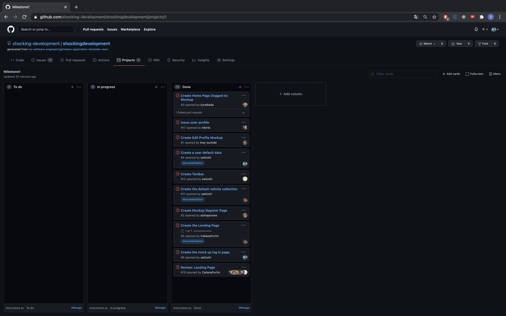

# Shocking Development

# TABLE OF CONTENTS
***
* [OVERVIEW](#overview)
* [MILESTONES](#milestones)
* [USER GUIDE](#user-guide)
* [TEAM MEMBERS](#team-members)

# OVERVIEW
***
The application provides Hawaiian electric customers ways to save their electric fees by cutting down their green house gas usages.

# MILESTONES
***
### Milestone 1

Here is a <a href="https://github.com/shocking-development/shockingdevelopment/projects/1">link</a> to the page for Milestone 1 (M1).  
Most of milestone 1 was centered around on developing the mockup pages and the basic data for the applications.

### Milestone 2

Here is a <a href="https://github.com/shocking-development/shockingdevelopment/projects/2">link</a> to the page for Milestone 2 (M2).  

### Milestone 3

Here is a <a href="https://github.com/shocking-development/shockingdevelopment/projects/3">link</a> to the page for the issues covered in Milestone 3 (M3).  

### Milestone 4
Here is a <a href="https://github.com/shocking-development/shockingdevelopment/projects/4">link</a> to the page for the issues covered in Milestone 4 (M4).  

# USER GUIDE
***
* Landing Page  
Homepage explaining what the site does and how to use it.  Users can navigate the site or get to the signup/signin page.

 

* Landing Page Alternate Version  
Homepage for users who are already logged into their account. Will dispaly a brief preview on their progress on how much greenhouse gases they have saved.

 

* Log In Page  
A page where returning users can log in to their registered account.

 

* Register Page  
A page where users can register for an account for the application.

 

* Profile Page  
A page that displays the user's input profile such as their username, location of where they live, and their major mode of transportaiton.

 

* Edit Profile Page  
A page that allows users to change any information that they would like to do. For instance, an user can change the area they live or their main mode of transportation.

 

* Data Page  
A page that provides the user a deeper analysis on how much greenhouse gases they have saved and would provide how much more they could save if they used alternative transportation options.

 

* Add Data Page  
A page that adds data to update the current user's data.

 

* GHG Calculator  
A page where users can calculate the amount of Greeh House Gases that they can either save or produce.

 

* Savings Page  
A page where it displays how much GHG a user has saved on their transportations.

 

* Admin Page  
Admins of the application can organize the user data by deleting users who have been inactive for a long period of time.

 

## TEAM MEMBERS
***
* [Caliana Fortin](https://calianafortin.github.io/)
  * Contact: fortinc@hawaii.edu

*  [James Galway-Severtson](https://jtmoka.github.io/)
   * Contact: jtmoka@hawaii.edu

* [Jerome Gallego](https://alohajerome.github.io/)
  * Contact: gallego6@hawaii.edu

* [Kyra Ikeda](https://kyraikeda.github.io/)
  * Contact: kyrai@hawaii.edu
* [Christian Jensen](https://christianjensenv.github.io/)
  * Contact: cjensen6@hawaii.edu

* [Matthew Kirts](https://mkirts.github.io/)
  * Contact: mkirts@hawaii.edu

* [Shinya Saito](https://saitoshi.github.io/)
  * Contact: saitoshi@hawaii.edu

* [Trey Sumida](https://treysumida.com/)
  * Contact: tasumida@hawaii.edu
