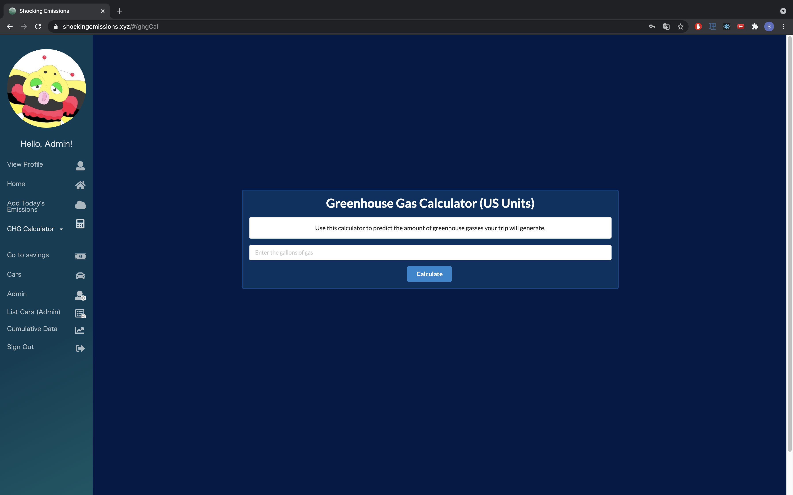

# Shocking Development

## Goal of the Project
The application provides Hawaiian electric customers ways to save their electric fees by cutting down their green house gas usages.

## Overview

## Milestones

### Milestone 1

Here is a <a href="https://github.com/shocking-development/shockingdevelopment/projects/1">link</a> to the page for Milestone 1 (M1).  

### Milestone 2 

Here is a <a href="https://github.com/shocking-development/shockingdevelopment/projects/2">link</a> to the page for Milestone 2 (M2).  
 
 ### Milestone 3
 
 Here is a <a href="https://github.com/shocking-development/shockingdevelopment/projects/3">link</a> to the page for the issues covered in Milestone 3 (M3).  

Most of milestone 1 was centered around on developing the mockup pages and the basic data for the applications.
### User's Guide
* Landing Page  

Homepage explaining what the site does and how to use it.  Users can navigate the site or get to the signup/signin page.
 
* Landing Page Alternate Version  

Homepage for users who are already logged into their account. Will dispaly a brief preview on their progress on how much greenhouse gases they have saved.
* Log In Page  

A page where returning users can log in to their registered account.
 
* Register Page  

A page where users can register for an account for the application. 
 
* Profile Page  

A page that displays the user's input profile such as their username, location of where they live, and their major mode of transportaiton.
 
* Edit Profile Page  

A page that allows users to change any information that they would like to do. For instance, an user can change the area they live or their main mode of transportation. 
 
* Data Page  

A page that provides the user a deeper analysis on how much greenhouse gases they have saved and would provide how much more they could save if they used alternative transportation options.
* Add Data Page  

A page that adds data to update the current user's data. 
* GHG Calculator 

A page where users can calculate the amount of Greeh House Gases that they can either save or produce. 
* Admin Page  

Admins of the application can organize the user data by deleting users who have been inactive for a long period of time.

## Team Members
* Caliana Fortin
  * contact: fortinc@hawaii.edu
  * portfolio: https://calianafortin.github.io/
*  James Galway-Severtson
   * contact: jtmoka@hawaii.edu
   * portfolio: https://jtmoka.github.io/
* Jerome Gallego
  * contact: gallego6@hawaii.edu
  * portfolio: https://alohajerome.github.io/
* Kyra Ikeda
  * contact: kyrai@hawaii.edu
  * portfolio: https://kyraikeda.github.io/
* Matthew Kirts
  * contact: mkirts@hawaii.edu
  * portfolio: https://mkirts.github.io/
* Shinya Saito
  * contact: saitoshi@hawaii.edu
  * portfolio: https://saitoshin.web.fc2.com/index.html
* Trey Sumida
  * contact: tasumida@hawaii.edu
  * portfolio: https://treysumida.com/
* Alex Wong
  * contact: awong20@hawaii.edu
