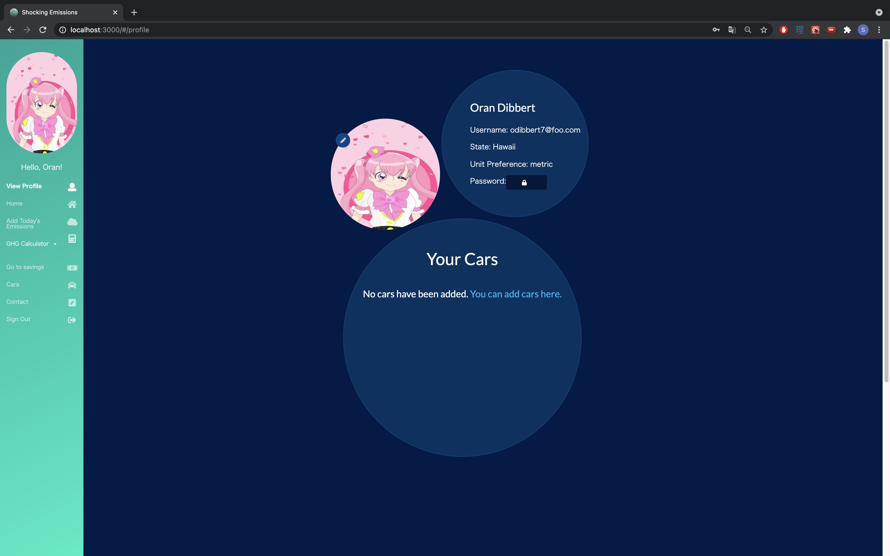
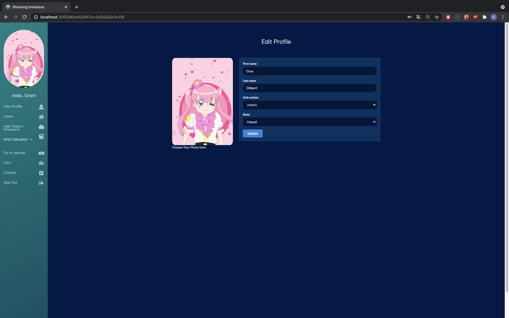
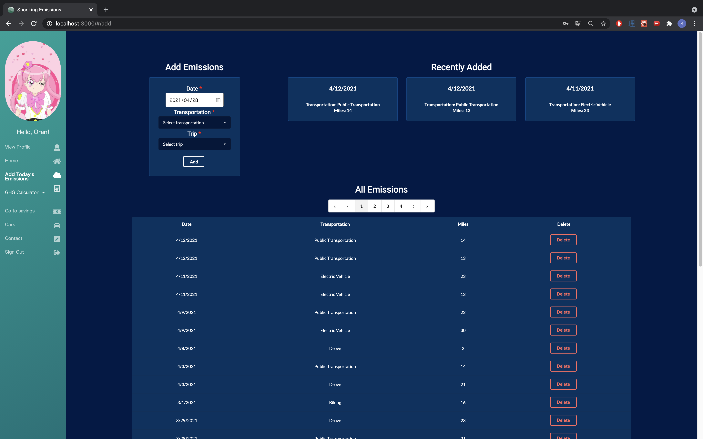
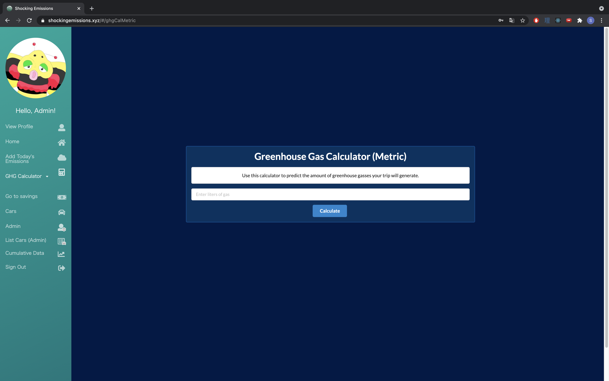

# Shocking Development

# TABLE OF CONTENTS
***
* [OVERVIEW](#overview)
* [MILESTONES](#milestones)
* [USER GUIDE](#user-guide)
* [PEER REVIEW](#review)
* [DEVELOPER'S GUIDE](#develop)
* [TEAM MEMBERS](#team-members)

# OVERVIEW
***
The application provides Hawaiian electric customers ways to save their electric fees by cutting down their green house gas usages.

Here is a [link to the application](https://shockingemissions.xyz/#/) which was deployed through [Digital Ocean](https://www.digitalocean.com/).

# MILESTONES
***
### Milestone 1

Here is a <a href="https://github.com/shocking-development/shockingdevelopment/projects/1">link</a> to the page for Milestone 1 (M1).  
Most of milestone 1 was centered around on developing the mockup pages and the basic data for the applications.

### Milestone 2

Here is a <a href="https://github.com/shocking-development/shockingdevelopment/projects/2">link</a> to the page for Milestone 2 (M2).  

### Milestone 3

Here is a <a href="https://github.com/shocking-development/shockingdevelopment/projects/3">link</a> to the page for the issues covered in Milestone 3 (M3).  

### Milestone 4

Here is a <a href="https://github.com/shocking-development/shockingdevelopment/projects/4">link</a> to the page for the issues covered in Milestone 4 (M4).  

# USER GUIDE
***
* Landing Page  
Homepage explaining what the site does and how to use it.  Users can navigate the site or get to the signup/signin page.

 

* Landing Page Alternate Version  
Homepage for users who are already logged into their account. Will dispaly a brief preview on their progress on how much greenhouse gases they have saved.

 

* Log In Page  
A page where returning users can log in to their registered account.

 

* Register Page  
A page where users can register for an account for the application.

 

* Profile Page  
A page that displays the user's input profile such as their username, location of where they live, and their major mode of transportaiton.

 

* Edit Profile Page  
A page that allows users to change any information that they would like to do. For instance, an user can change the area they live or their main mode of transportation.

 
* Edit Password Page  
A page that allows users to change their password that is used for login purposes.

* Data Page  
A page that provides the user a deeper analysis on how much greenhouse gases they have saved and would provide how much more they could save if they used alternative transportation options.

 

* Add Data Page  
A page that adds data to update the current user's data.

 

* GHG Calculator  
A page where users can calculate the amount of Green House Gases that they can either save or produce. Based on the user's unit preference, the calculator can be done both metric and US units.

 
For metric units calculations.

 

* Savings Page  
A page where it displays how much GHG a user has saved on their transportations.

 

* Admin Page  
Admins of the application can organize the user data by deleting users who have been inactive for a long period of time.

 
* Cumulative Data Page (Admin)  
If admin is logged into the application, they can see the most up to date cumulative data.

 
* ListCars Admin page  
Admins of the application can view the cars from the database.

# USER REVIEW 
Here are some community feedback Shocking Emissions has received.
* PERSON A 
  "The site is aesthetically pleasing and well organized. Using the functions was intuitive as well. The graphs were also easy to interpret."
## DEVELOPER'S GUIDE
***
To download the source code please head over to the repository [page](https://github.com/shocking-development/shockingdevelopment) and download the master branch.
 
To run the native app, cd into the master branch directory of your computers native terminal and get to the app folder.

Then, install meteor in the app folder using this command

Then run meteor npm run start within the app folder head to http://localhost:3000 to see the app running.

To modify the native source code, it is highly recommended that you use IntelliJ Idea to modify the source code to your liking. You can download it [here](https://www.jetbrains.com/idea/download/#section=mac).

## TEAM MEMBERS
***
* [Caliana Fortin](https://calianafortin.github.io/)
  * Contact: fortinc@hawaii.edu

*  [James Galway-Severtson](https://jtmoka.github.io/)
   * Contact: jtmoka@hawaii.edu

* [Jerome Gallego](https://alohajerome.github.io/)
  * Contact: gallego6@hawaii.edu

* [Kyra Ikeda](https://kyraikeda.github.io/)
  * Contact: kyrai@hawaii.edu
* [Christian Jensen](https://christianjensenv.github.io/)
  * Contact: cjensen6@hawaii.edu

* [Matthew Kirts](https://mkirts.github.io/)
  * Contact: mkirts@hawaii.edu

* [Shinya Saito](https://saitoshi.github.io/)
  * Contact: saitoshi@hawaii.edu

* [Trey Sumida](https://treysumida.com/)
  * Contact: tasumida@hawaii.edu
