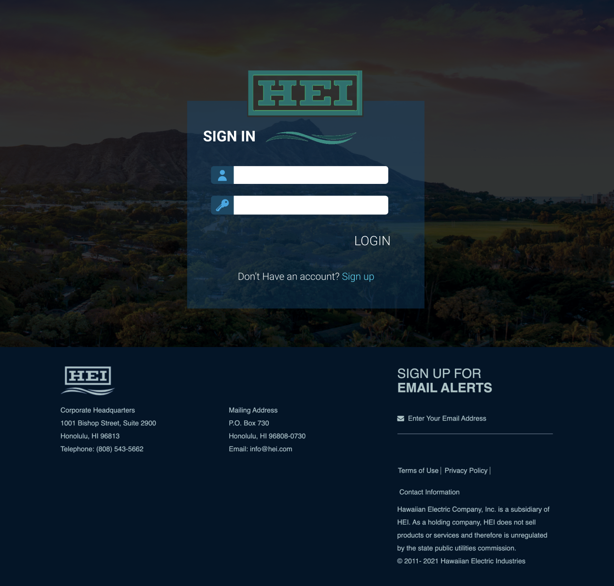

# Shocking Development

## Goal of the Project
The application provides Hawaiian electric customers ways to save their electric fees by cutting down their green house gas usages.

## Overview

### User's Guide
* Landing Page  

Homepage explaining what the site does and how to use it.  Users can navigate the site or get to the signup/signin page.
 
* Log In Page  

A page where returning users can log in to their registered account.
 
* Register Page  

A page where users who already have a registered account can log back in.
 
* Profile Page  

A page that displays the user's input profile such as their username, location of where they live, and their major mode of transportaiton.
 
* Edit Profile Page  

A page that allows users to change any information that they would like to do. For instance, an user can change the area they live or their main mode of transportation. 

## Team Members
* Caliana Fortin
  * contact: fortinc@hawaii.edu
  * portfolio: https://calianafortin.github.io/
*  James Galway-Severtson
   * contact: jtmoka@hawaii.edu
   * portfolio: https://jtmoka.github.io/
* Jerome Gallego
  * contact: gallego6@hawaii.edu
  * portfolio: https://alohajerome.github.io/
* Kyra Ikeda
  * contact: kyrai@hawaii.edu
  * portfolio: https://kyraikeda.github.io/
* Matthew Kirts
  * contact: mkirts@hawaii.edu
  * portfolio: https://mkirts.github.io/
* Shinya Saito
  * contact: saitoshi@hawaii.edu
  * portfolio: https://saitoshi.github.io/bio/
* Trey Sumida
  * contact: tasumida@hawaii.edu
  * portfolio: https://treysumida.com/
* Alex Wong
  * contact: awong20@hawaii.edu
